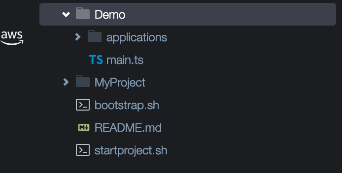
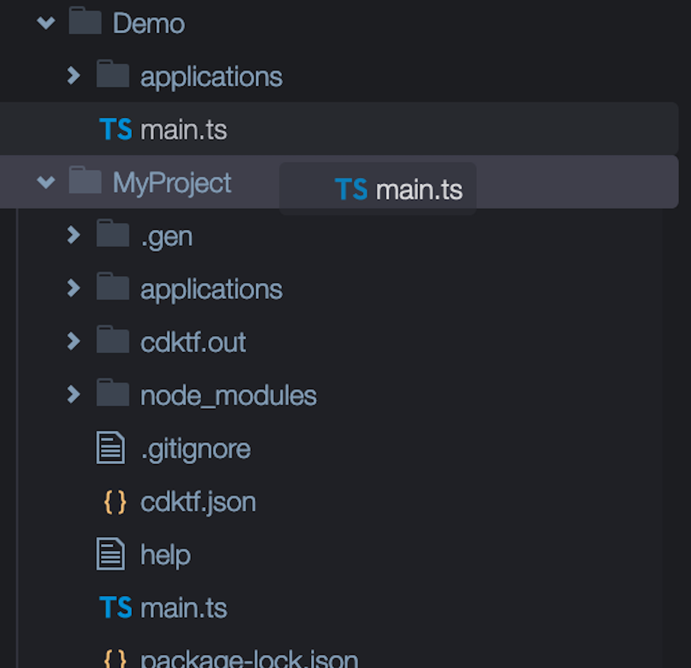
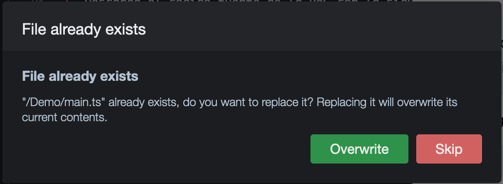
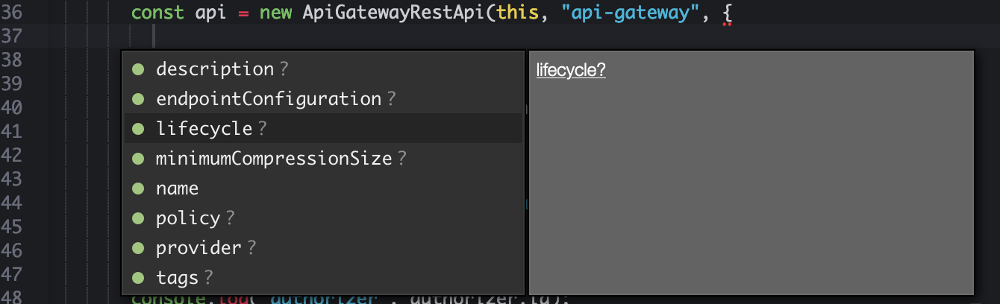

# Módulo 3: Arquitectura PoC

En este módulo trabajarás con una típica arquitectura orientada a micro-servicios basada en API Gateway, Lambda y DynamoDB, sumado a esto finalmente agregaremos una capa de autenticación a nuestra API utilizando Amazon Cognito.

## Sobre este módulo
El demo y su código fuente no pretenden ser una referencia de programación, mas bien el objetivo es demostrar que podemos trabajar con un lenguaje familiar para cualquier developer y conseguir que este mismo sea el provisionador de los recursos que necesita para su aplicativo sin tener que aprender HCL.

## Instrucciones (Parte 1)

1. Descarga el codigo fuente de la PoC con la siguiente instrucción
    ```bash
    wget --output-document=$HOME/environment/demo.zip https://raw.githubusercontent.com/hadock/CDKTF-From-Zero-to-Hero/master/Assets/demo.zip && unzip ~/environment/demo.zip && rm ~/environment/demo.zip
    ```
    En el arbol de directorios veras que se acaba de crear uno nuevo llamado Demo
    

1. Vas a mover los archivos desde este directorio al directorio donde está el proyecto CDK, que en mi caso se llama **MyProject**
    
    

1. Cuando te pida reemplazar el archivo `main.ts` le damos clic en **Overwite**

    
    

### :star: Recap (Parte 1)
Hasta aquí lo que hemos realizado es descargar el codigo fuente que contiene la definición de la arquitectura en lenguaje TypeScript.

+ **applications** `aqui están los fuentes de la arquitectura y la lambda que desplegaremos`
+ **main.ts** `este es el arhivo principal que cdktf va a buscar cada vez que ejecutamos un despliegue` 


## Instrucciones (Parte 2)

1. Abre el archivo `main.ts` y fíjate en esta lineas 
    ```typescript
    import { MyApp1 } from './applications/backends/myapp1';
    import { MyAPI1 } from './applications/apis/myapi1'
    import { MyAPIdeploy1 } from './applications/apis/apideploy';
    import { MyAuthentication } from './applications/authentication/cognito';
    ```
    > Aquí podrás ver que tenemos referenciados los archivos que especifican tu arquitectura y aplicativo o microservicio de nombre **myapp1**

1. Más abajo, podras ver que estamos utilizando esos `imports` para ir conectando tu architectura con el applicativo o microservicio.
    
    > Primero, partimos aclarando que esto es una `interface` creada para este demo, no es algo que venga con CDK, esta misma la utilizaremos para probar como podrían funcionar multiples stacks o ambientes
    
    ```typescript
    interface MyStackConfig {
      prefix: string,
      environment: string,
      region: string;
    }
    ```

    > Aquí define la autenticación basada en cognito
    
    ```typescript
    const Authentication = new MyAuthentication(this, 'Authentication', config);
    ```

    > Aquí define la api y le pasa el objeto que contiene las expecificaciones de nuestro cognito
    
    ```typescript
    const API = new MyAPI1(this, 'API', config, Authentication);
    ```
    
    > En este punto referenciamos a nuestro backend, que en su interior creará una Lambda, una Tabla DynamoDB y los permisos necesarios para que se conecten entre sí, a su vez le pasamos la instancia de nuestra API para que se pueda vincula a ella
    
    ```typescript
     new MyApp1(this, 'Hello', config, API);
    ```
    
    > Luego creamos un deployment de API Gateway que permitirá pasar los cambios que hayamos realizado a un stage definido en el objeto `config`
    
    ```typescript
    new MyAPIdeploy1(this, 'APIDeploy', config, API);
    ```
    
    > Finalmente, una linea muy importante es generar nuestro stack. En la siguiente linea, ubicada casi al final de nuestro archivo `main.ts` te contrarás con esto
    
    ```typescript
    new MyStack(app, 'PoC1', {environment: "prod", region: "us-west-1", prefix: ""});
    ```
    
1. Con algo de curiosidad, procede a revisar el directorio `applications` para que puedas ir fijando en algunos parametros que tienen los objetos, algunos importantes a mencionar son
    
    > Normalmente el constructor de las clases recibe 3 parámetros, por ejemplo:

    ```typescript
    new ApiGatewayRestApi(this, "api-gateway", {
        name: config.prefix+"rest-api"
    });
    ```
    
    a. **``` this```** Con esto indicamos al constructor de que stack estamos hablando
    
    b. **```  "api-gateway" ```** su funcion es dar un nombre lógico en tu stack de terraform, puede ser el que tu quieras, pero debe ser unico para el stack

    c. **```{ name: config.prefix+"rest-api"}```** este objeto y sus parámetros minimos cambian según el recurso que necestiamos crear, para el caso de **API Gateway** lo único que nos pide es `name`, vale decir un nombre que tendrá el recurso ***físico***
    

    
### :star: Recap (Parte 2)
En este punto ya deberías entender como está armado nuestro archivo principal `main.ts`. En el siguiente módulo vamos a desplegar y hacer cambios sobre nuestra arquitectura y aplicativo o microservicio backend

## :bulb: Tip
Si quieres saber que parámetros son mandatorios o no cuando instancias un objeto en TypeScript usando Cloud9, solo debes posicionar el cursor en el objeto que estas creando, presionar **[CTRL] + SPACE** y apareceran las alternativas y posibles atributos. Aquellos con **"?"** son opcionales y los que no, son mandatorios.

