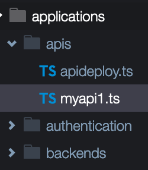
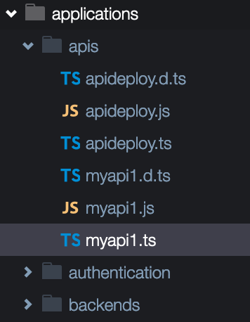

# Módulo 4: Desplegar Infraestructura

CDKTF provee comandos para desplegar y eliminar stacks, siempre que realices un `deploy` se invocará un `synth` y posteriomente terraform realizara el plan para mostrarte los cambios que realizará en tu arquitectura física.

## Sobre este módulo
En este modulo realizarás el despliegue de la arquitectura y el aplicativo tal como se encuentran, posterior a esto, habilitaremos que solo requests con **Amazon Cognito** puedan consultar nuestra API, y para esto deberás ser capaz de encontrar en el código fuente el lugar especifico donde debes cambiar para habilitarlo. Finalmente, revisaremos los cambios que se generaron y los recursos creados producto de la habilitación


## Instrucciones 
Antes de comenzar con cualquier comando, toma nota que en este momento los archivos `.ts` de tu directorio se encuentran solos, y posterior a la ejecución de los despliegues, habrán nuevos archivos `.js` y `.d.ts`, cualquier modificacion que requieras hacer, asegurate de no hacerla contra esos archivos, dado que se sobre-escriben por cada vez que realizas un `deploy`  

Antes


Después



1. Asegurate de estar en el directorio correcto, si no estás seguro, puedes verificarlo con la siguiente instrucción
    ```bash
    pwd
    ```
    si el resultado es: 
    ```bash
    /home/ec2-user/environment
    ```
    entonces deberás entrar al directorio de tu proyecto con una instruccion como la siguiente

    ```bash
    cd Nombre_De_Tu_Directorio
    ```
    
1. Una vez en el directorio, vamos a ejecutar la primera instrución.
    ```bash
    cdktf synth
    ```
    > Esta instrucción nos permitirá saber si el código está correcto y a su vez este mismo va generar el stack de terraform y todos sus assets en el directorio `./cdktf.out`, si tienes curiosidad de ver que hay ahí dentro, puedes dar un vistazo

1. Ahora realizarás un despliegue a la cuenta, ejecutando la siguiente instrucción
    ```bash
    cdktf deploy
    ```
    > Esto es posible sin credenciales de AWS dado que estamos en un ambiente Cloud9 quien obtiene y renueva las credenciales por nosotros y tiene los mismos permisos que tu usuario IAM

1. Podrás notar que luego de la ejeción te pide confirmar los cambios que se aplicarán, tan solo escribe `yes` y presiona `enter`
    ```bash
    Diff: 13 to create, 0 to update, 0 to delete.

    Do you want to perform these actions?
     CDK for Terraform will perform the actions described above.
     Only 'yes' will be accepted to approve.
    
     Enter a value: yes
    ```

1. Si todo ha concluido correctamente, deberías tener tus recursos provisionados en la cuenta y la salida de tu despliegue debe ser el endpoint de tu API Gateway
    ```bash
    Summary: 13 created, 0 updated, 0 destroyed.

    Output: APIDeploy_endpoint_0EE69AC2 = https://xxxxxxxxxx.execute-api.us-west-1.amazonaws.com/prod
            Authentication_user_pool_client_id_C436525B = 670dngomt451l48t91xxxxxxxx
            Authentication_user_pool_id_407C282F = us-west-1_txxxxxxxx
    ```

1. Probaremos ahora tu API usando la siguiente instrucción en tu terminal de Cloud9
    ```bash
    curl -XGET https://xxxxxxxxxx.execute-api.us-west-1.amazonaws.com/prod/hello?keyid=1
    ```
    Reemplaza las **xxxxxxxxxx** por el identificador de tu API
    el resultado debe ser algo como

    ```bash
    {"msg":"Hello from my NodeJS Lambda","items":[]}
    ```


## :bulb: Challenge
Con lo que ya haz podido ejecutar hasta aquí, deberás ser capaz de naufragar en el código fuente que está en el directorio `applications` guiado por las referencias del archivo `main.ts`.
Encuentra el lugar donde se vincula API Gateway con Amazon Cognito para permitir que solo los request autenticados puedan llegar al backend